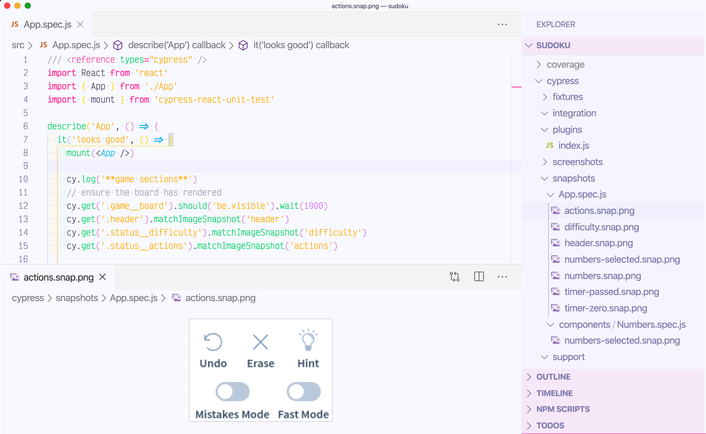

# sudoku [![gh status][gh image]][gh url]    [![renovate-app badge][renovate-badge]][renovate-app]

Sudoku game forked from [raravi/sudoku](https://github.com/raravi/sudoku).

This fork is showing how to test game's components using Cypress, [cypress-react-unit-test](https://github.com/bahmutov/cypress-react-unit-test), and the open source visual image diffing plugin [cypress-image-snapshot](https://github.com/palmerhq/cypress-image-snapshot). All images are stored in [cypress/snapshots](cypress/snapshots) folder.

## Information

Read [Visual testing for React components using open source tools](https://glebbahmutov.com/blog/open-source-visual-testing-of-components/) and browse these [slides](https://slides.com/bahmutov/i-see-what-is-going-on).

## Videos

Watch the entire free series of videos explaining visual testing step-by-step in the playlist [Visually testing React component using open source tools](https://www.youtube.com/playlist?list=PLP9o9QNnQuAYhotnIDEUQNXuvXL7ZmlyZ).

- [Introduction](https://youtu.be/432Il-_hVrQ)
- [Writing first React component test](https://youtu.be/RqdXukwIdj0)
- [Visual testing for Numbers element](https://youtu.be/hDTYBiKJBAY)
- [Visual test for selected number](https://youtu.be/5NuLQgdk-rU)
- [Testing static sections of the game](https://youtu.be/D-u_ojVTgqQ)
- [Testing timer display by controlling the application's clock](https://youtu.be/qQikRD_ygug)
- [Restore synthetic clock](https://youtu.be/inLue14mxm0)
- [Update image snapshots](https://youtu.be/sd4MFgEUfPs)
- [Style Numbers component](https://youtu.be/9hkyUhllTSw)
- [Click event test for Numbers component](https://youtu.be/F1FC4hZpAX4)
- [Mocking value passed via Context Provider](https://youtu.be/wvJgKz46a8A)
- [Storing snapshot images](https://youtu.be/C_XVcftt14A)
- [Running image tests on CI](https://youtu.be/gngLg1_J-9Q)
- [Use image tolerance value when comparing image snapshots](https://youtu.be/hTukgIQh81w)
- [using a local Docker container to generate local snapshots](https://youtu.be/1XQbGtRITys)
- [Running the same Docker container locally and on CI](https://youtu.be/FcoHSjrhXo4)
- [Dealing with dynamic data by hiding it from the snapshot](https://youtu.be/ExihfuqqeiE)
- [Make Sudoku board deterministic](https://youtu.be/ZyBwxQ8OOKA)
- [Local interactive workflow to skip snapshots](https://youtu.be/-M95yDr1Qfs)
- [Clipping snapshots](https://youtu.be/ORf2mESaldY)
- [Add wait before taking a snapshot](https://youtu.be/rcWwlVdarF0)
- [Testing responsive design](https://youtu.be/j8yV3uKIJO0)
- [Testing responsive design - alternative take](https://youtu.be/YTUk5f2YS74)
- [Collected code coverage](https://youtu.be/HCDWGVdLQjA)
- [Using GitHub Actions](https://youtu.be/HRAEQ_6GU0g)
- [Mocking ES6 module import for deterministic board](https://youtu.be/Ks7O4tuqyK8)
- [Refactor loading of fixtures to use imports](https://youtu.be/AcM4Uhp3yOw)
- [Test to play the first move](https://youtu.be/bD3y94UB0_c)
- [Write a test that wins the game](https://youtu.be/usLZnM4u3ZM)
- [Post visual status check to GitHub](https://youtu.be/fNKWmPOpLD8)
- [Factoring out Overlay component](https://youtu.be/NH1hOJQAkc0)
- [Setting up Prettier](https://youtu.be/l-ikqcKdJHY)

Still to record:

- making a pull request commit check for visual results

## Misc videos

Small loops and demos

- [Sudoku game](https://youtu.be/lxWEE0vDq6c)
- [Responsive styles](https://youtu.be/w00vpIEVZPQ)
- [Components in React DevTools](https://youtu.be/f9sbdiAEHxs)
- [Sudoku deterministic board with one move](https://youtu.be/WcXZpqAKwQQ)
- [Visual diffs as commit status](https://youtu.be/BDgqweqR36Y)

## Demo

[gh image]: https://github.com/bahmutov/sudoku/workflows/master/badge.svg?branch=master
[gh url]: https://github.com/bahmutov/sudoku/actions
[renovate-badge]: https://img.shields.io/badge/renovate-app-blue.svg
[renovate-app]: https://renovateapp.com/
